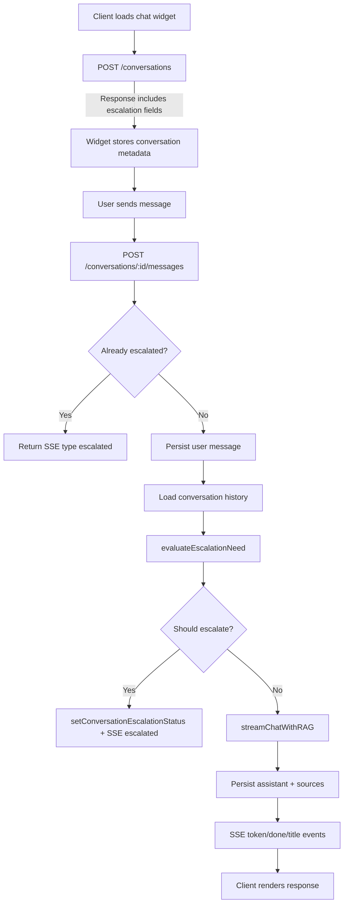

# API

A Fastify API server.

## Getting Started

First, install dependencies:

```bash
pnpm install
```

Then, run the development server:

```bash
pnpm dev
```

The API will be available at [http://localhost:3001](http://localhost:3001).

## Endpoints

- `GET /` - Hello World endpoint
- `GET /health` - Health check endpoint
- `GET /conversations/:id/events` - SSE stream for conversation-level events (agent joins)
- `POST /conversations/:id/agent/join` - Mark a human agent as joined (emits SSE event)

## Conversation Flow (Mermaid)



## Environment Variables

Copy `.env.example` to `.env` and configure:

- `PORT` - Port number for the API server (default: 3001)

## Building

To build the production bundle:

```bash
pnpm build
```

To run the production server:

```bash
pnpm start
```
