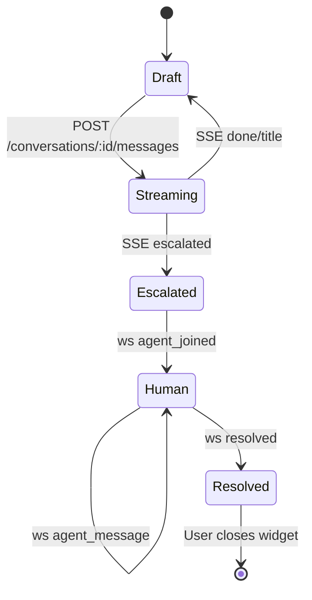

# Chat Widget

An embeddable AI chat widget with RAG (Retrieval Augmented Generation) support, built with Preact, TypeScript, and Tailwind CSS. Features full style isolation using Shadow DOM.

## Features

- 🎨 **Customizable Theming** - Override colors, fonts, and styles via props or CSS variables
- 🔒 **Style Isolation** - Uses Shadow DOM to prevent CSS conflicts with host pages
- 🤖 **AI-Powered** - Integrates with GPT-4o for intelligent responses
- 📚 **RAG Support** - Retrieval Augmented Generation for context-aware answers
- ⚡ **Streaming Responses** - Real-time streaming of AI responses via SSE
- 📝 **Source Citations** - Displays sources used to generate responses
- 💬 **Conversation History** - Maintains context across multiple messages
- 📱 **Responsive Design** - Works on desktop and mobile devices
- 🎭 **TypeScript** - Full type safety for better DX

## Installation

```bash
npm install chat-widget
# or
pnpm add chat-widget
# or
yarn add chat-widget
```

## Quick Start

### HTML (via data attribute)

```html
<!DOCTYPE html>
<html>
  <head>
    <script type="module" src="https://unpkg.com/chat-widget"></script>
  </head>
  <body>
    <div data-chat-widget data-api-url="https://your-api.com"></div>
  </body>
</html>
```

### JavaScript/TypeScript

```typescript
import { initChatWidget } from "chat-widget";

const cleanup = initChatWidget({
  apiUrl: "https://your-api.com",
  containerId: "chat-widget-container",
  onConversationCreate: (conversationId) => {
    console.log("Conversation created:", conversationId);
  },
});

// Later, to unmount:
cleanup();
```

### Framework Component Usage (React, Preact, etc.)

```tsx
import { ChatWidget } from "chat-widget";

function App() {
  return (
    <ChatWidget
      apiUrl="https://your-api.com"
      onConversationCreate={(id) => console.log("Created:", id)}
    />
  );
}
```

> The ES module build bundles Preact internally, so you can drop the widget into React, Vue, or vanilla SPA tooling without configuring `preact/compat` aliases. Treat the component as an isolated subtree: it will not share hooks or context with a surrounding React tree.

## Theming & Customization

The widget uses Shadow DOM for style isolation, but provides two ways to customize its appearance:

### Method 1: Theme Props (Recommended)

Pass a \`theme\` object to customize colors, fonts, and other styles:

```typescript
import { initChatWidget } from "chat-widget";

initChatWidget({
  apiUrl: "https://your-api.com",
  theme: {
    bg: { chatMessageUser: "#ff0000" },
    text: { chatMessageUser: "#ffffff" },
  },
});
```

- Runtime theme hooks currently exposed: `theme.bg.chatMessageUser` and `theme.text.chatMessageUser`. Manage any additional styling hooks directly in your host stylesheet.
- The widget does not ship with defaults for host-level custom properties; declare the ones you use to avoid unresolved values.

### Method 2: CSS Variables

Override CSS custom properties from the host page. This works because CSS variables penetrate Shadow DOM boundaries:

```html
<style>
  /* Override widget variables */
  #chat-widget-container {
    --jexity-assistant-bg-chat-message-user: #ff0000;
    --jexity-assistant-text-chat-message-user: #ffffff;
  }
</style>

<div id="chat-widget-container"></div>
<script type="module">
  import { initChatWidget } from "/src/main.tsx";
  import "/src/styles.css";

  initChatWidget({
    containerElement: document.querySelector("#chat-widget-container"),
  });
</script>
```

### Available CSS Variables

The widget ships without default values for host-facing CSS variables. Declare the ones you need (for example, colors, typography, etc.) inside your application styles and the widget will inherit them through the shadow boundary.

## API Reference

### \`initChatWidget(options)\`

Initializes and mounts the chat widget.

**Parameters:**

| Option                   | Type                     | Default       | Description                                    |
| ------------------------ | ------------------------ | ------------- | ---------------------------------------------- |
| \`apiUrl\`               | \`string\`               | \`undefined\` | Base URL for the chat API                      |
| \`conversationId\`       | \`string\`               | \`undefined\` | Existing conversation ID to resume             |
| \`containerId\`          | \`string\`               | \`undefined\` | ID of the container element                    |
| \`containerElement\`     | \`HTMLElement\`          | \`undefined\` | Container element (alternative to containerId) |
| \`theme\`                | \`ChatWidgetTheme\`      | \`undefined\` | Theme customization object                     |
| \`onConversationCreate\` | \`(id: string) => void\` | \`undefined\` | Callback when conversation is created          |

**Returns:** \`() => void\` - Cleanup function to unmount the widget

### \`ChatWidgetTheme\` Interface

```typescript
interface ChatWidgetTheme {
  bg?: { chatMessageUser?: string };
  text?: { chatMessageUser?: string };
}
```

## Examples

### Custom Brand Colors

```typescript
initChatWidget({
  apiUrl: "https://api.example.com",
  theme: {
    bg: { chatMessageUser: "#7c3aed" },
    text: { chatMessageUser: "#f8fafc" },
  },
});
```

### Additional Styling

Inject any extra CSS you need alongside the widget—for example, typography or layout rules applied to the host container—then call `initChatWidget` as shown above.

## Development

```bash
# Install dependencies
pnpm install

# Start development server
pnpm dev

# Build for production
pnpm build

# Type check
pnpm check-types

# Lint
pnpm lint
```

## Architecture

- **Shadow DOM**: Ensures style isolation from the host page
- **Preact 10**: Lightweight React-compatible runtime
- **Tailwind CSS v4**: Utility-first CSS framework
- **TypeScript**: Full type safety
- **Vite**: Fast build tool and dev server
- **react-shadow**: Shadow DOM integration powered by `preact/compat`

## Realtime Lifecycle



## React Compatibility Notes

- The library ships with `preact/compat`, exposing the React 18+ component API surface while keeping the bundle lean. No peer dependency on `react`/`react-dom` is required when you import the widget.
- Script embeds (`chat-widget.umd.js`) auto-register `initChatWidget` globally; no framework runtime needs to be present on the host page.
- When you import `ChatWidget` inside an existing React application, it renders within its own Preact tree. Do not expect shared React context, Suspense boundaries, or error boundaries to cross that boundary.
- Server-side rendering is intentionally unsupported—SSR helpers are stubbed so accidental usage fails fast. Mount the widget on the client only.
- React DevTools will not inspect the widget tree because it runs on Preact internals. Use standard browser tooling (or preload Preact DevTools) if you need debugging inside the widget.
- Avoid project-level aliases that globally swap React for Preact unless you have audited the rest of your codebase; the widget already bundles what it needs and can coexist with a full React app without extra configuration.

## Browser Support

- Chrome/Edge 88+
- Firefox 63+
- Safari 13.1+
- No IE11 support (Shadow DOM requirement)

## License

MIT
