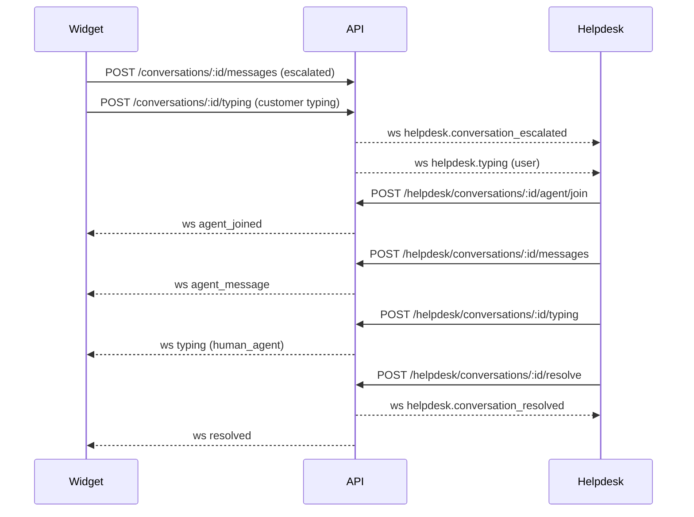

# Web Application & Helpdesk Dashboard

The `apps/web` Next.js project now serves both the main SaaS experience (marketing, onboarding, admin, and team dashboards) and the consolidated helpdesk dashboard that previously lived in `apps/helpdesk`. Running this app locally gives access to:

- **Public/SaaS surfaces** under `/` and `/dashboard/*`.
- **Helpdesk Dashboard** under `/helpdesk`, which surfaces escalated widget conversations for human agents.

## Local Development

```bash
pnpm install
pnpm dev --filter web
```

Set the following environment variables (e.g., via `.env.local`) so both the SaaS flows and helpdesk websocket feeds can reach the API:

```bash
NEXT_PUBLIC_API_URL=http://localhost:3001
NEXT_PUBLIC_API_WS_URL=ws://localhost:3001
```

## Helpdesk Dashboard

Next.js dashboard that surfaces escalated widget conversations in real time so human agents can claim, reply, and resolve threads.

### Key Features

- Live list of escalated conversations pulled from `GET /helpdesk/escalations`
- Websocket feed (`/ws/helpdesk`) for new escalations, agent claims, messages, and resolutions
- Claim/resolve workflow that locks the widget and displays system banners
- Inline transcript viewer with system breadcrumbs (escalated, joined, resolved)
- Real-time typing indicators for both the customer and the assigned agent after escalation

### Agent Workflow



#### Typing Indicators

- The widget sends `POST /conversations/:id/typing` heartbeats once a thread is escalated so the dashboard can show "Customer is typing...".
- When an agent with the claim drafts a reply, the dashboard POSTs `/helpdesk/conversations/:id/typing`, and the API forwards a `typing` event over `/ws/conversations/:id` so the widget can surface an agent typing badge.

### Files of Interest

- `app/helpdesk/page.tsx` – Shell that loads conversations, opens websockets, and wires state.
- `components/conversations/ConversationsPanel.tsx` – Sidebar list and filtering.
- `components/conversations/Conversation.tsx` – Transcript, claim, resolve UI.
- `lib/api.ts` – Thin client for helpdesk-specific endpoints (fetch, websocket helpers, etc.).

### Testing & Linting

```bash
pnpm lint --filter web
pnpm check-types --filter web
```

End-to-end flows currently rely on the API + widget running locally; start those apps before testing claim/resolve behavior.
