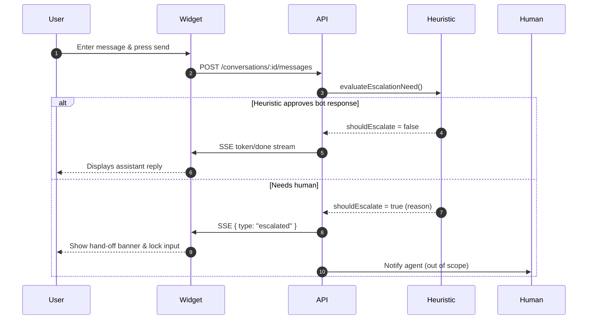

# Chat Escalation Flow

This document explains how the chat widget and API coordinate to flag conversations that need a human agent.

## Data Model

- `conversations` table now includes `is_escalated`, `escalated_reason`, and `escalated_at` columns.
- DTOs (`@repo/dto`) expose the new fields so every API response carries the escalation metadata.
- `setConversationEscalationStatus` in `apps/api/src/lib/database.ts` centralizes updates to those columns.

## Backend Flow

1. Every POST `/conversations/:id/messages` call stores the user message, loads recent history, and then runs `evaluateEscalationNeed` (`apps/api/src/lib/escalation.ts`).
2. If the conversation is already escalated (or the heuristic says it should be), the API:
   - Persists the escalation metadata via `setConversationEscalationStatus`.
   - Streams a single SSE payload `{ type: "escalated", conversationId, reason?, escalatedAt }` and ends the response.
3. Otherwise, the request proceeds to `streamChatWithRAG` and behaves like before.
4. All conversation endpoints (`create`, `list`, `get`) serialize escalation fields so clients can hydrate state instantly.

### Heuristic Details

- Keyword scan (`human`, `agent`, `escalate`, `manager`, etc.).
- Repeated user questions inside the last 3 user turns trigger escalation.
- The helper returns a reason string for operator logs and UI messaging; swap this module with a classifier without touching the route.

## Frontend Flow

- `ChatWidget` tracks an `escalationState` derived from the conversation DTO and from SSE events.
- The composer is disabled and a yellow banner is shown when `isEscalated` is true.
- When the widget receives the SSE `escalated` event mid-stream, it immediately stops streaming, clears the loader, and locks the UI.
- Attempting to send more prompts after escalation is ignored, relying on the banner for context.



## SSE Contract

```ts
interface EscalatedEvent {
  type: "escalated";
  conversationId: string;
  reason?: string;
  escalatedAt: string; // ISO timestamp
}

interface AgentJoinedEvent {
  type: "agent_joined";
  conversationId: string;
  agentName: string;
  joinedAt: string; // ISO timestamp
}
```

Clients subscribe via the same `streamMessage` helper; they now need to handle this extra discriminant alongside `token`, `done`, `title`, and `error` events.

For real-time agent presence, the widget also opens `GET /conversations/:id/events`, an SSE stream that emits `agent_joined` whenever a human takes over. Support tools trigger the event by calling `POST /conversations/:id/agent/join` with `{ agentName }`.

## Testing Tips

1. Start the API (`pnpm --filter api dev`) and widget (`pnpm --filter chat-widget dev`).
2. Open the widget, send a prompt that includes phrases like "I need a human agent". You should see the escalation banner immediately and no AI response.
3. Inspect the `conversations` table (or use the GET `/conversations/:id` endpoint) to confirm the new fields.
4. Try resending a message; the frontend should ignore it and the backend will stream another `escalated` event if contacted.
